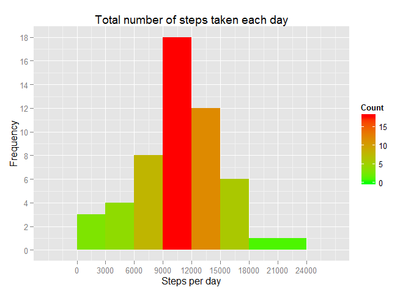
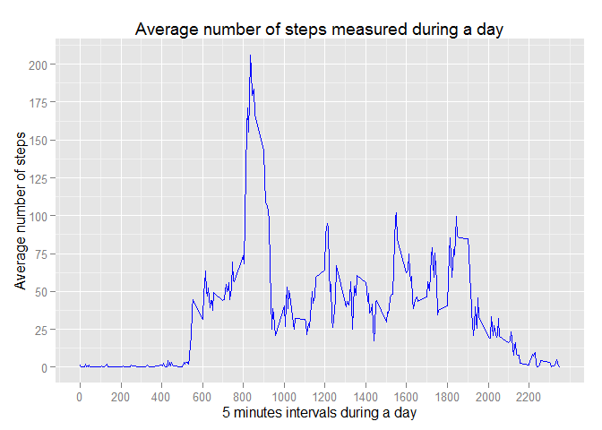
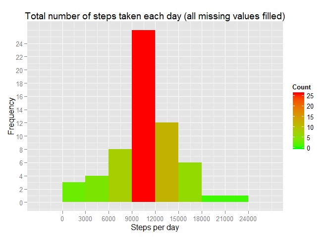
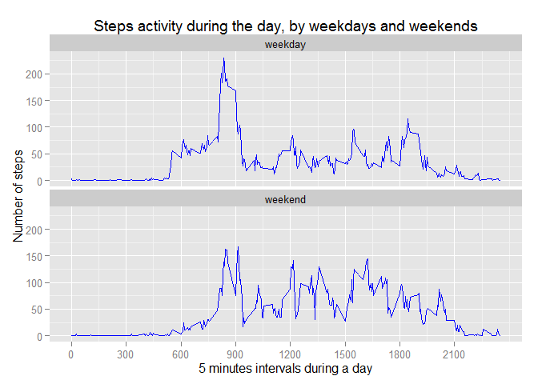

# Reproducible Research: Peer Assessment 1
## Packages used in this script

```r
library(ggplot2)
```
## Loading and preprocessing the data:

```r
data <- read.csv("activity.csv")
```
# Tasks:
## What is mean total number of steps taken per day?
Calculating the total number of steps taken per day:

```r
step_day_sum <- aggregate(steps ~ date, data, sum)
```
Making and printing the histogram of the total number of steps taken each day:

```r
hist1 <- ggplot(data=step_day_sum, aes(step_day_sum$steps)) + 
  geom_histogram(aes(fill=..count..), binwidth = 3000) +
  scale_fill_gradient("Count", low = "green", high = "red") + scale_x_continuous(breaks=seq(0, 25000, 3000)) +
  scale_y_continuous(breaks=seq(0, 25, 2)) +
  ggtitle("Total number of steps taken each day") +
  ylab("Frequency") + xlab("Steps per day")
hist1
```

 
Calculating the mean and median of the total number of steps taken per day:

```r
steps_mean <- as.integer(mean(step_day_sum$steps, na.rm=T))
steps_median <- median(step_day_sum$steps, na.rm=T)
```
- The **mean** of the total number of steps taken per day is *10766*
- The **median** of the total number of steps taken per day is *10765*

## What is the average daily activity pattern?
Making and printing a time series plot of the 5-minute interval (x-axis) and the average number of steps taken, averaged across all days (y-axis):

```r
step_day_int_mean <- aggregate(steps ~ interval, data, mean, na.action = na.omit)
plot1 <- ggplot(step_day_int_mean, aes(x=interval, y=steps))
plot1 + geom_line(colour = "blue") +
    scale_x_continuous(breaks=seq(0, 2355, 200)) +
    scale_y_continuous(breaks=seq(0, 250, 25)) +
    ggtitle("Average number of steps measured during a day") +
    ylab("Average number of steps") + xlab("5 minutes intervals during a day")
```

 
Calculating and printing which 5-minute interval, on average across all the days in the dataset, contains the maximum number of steps:

```r
max_step <- which.max(as.double(step_day_int_mean[, "steps"]))
step_day_int_mean[max_step, ]
```

```
##     interval    steps
## 104      835 206.1698
```

## Imputing missing values
Calculating the total number of missing values in the dataset:

```r
na <- sum(is.na(data$steps))
na_percent <- round(na/nrow(data)*100, 2)
```
- We have *2304* missing data for variable *steps*, or *13.11* % from total.

Filling in all of the missing values in the dataset and create a new dataset that is equal to the original dataset but with the missing data filled in:

```r
stepValues <- data$steps
stepValues[is.na(stepValues)] <- ceiling(tapply(X=data$steps, INDEX=data$interval, FUN=mean, na.rm=TRUE))
newData <- cbind(stepValues, data[,2:3])
```

Making a histogram of the total number of steps taken each day:

```r
full_step_day_sum <- aggregate(stepValues ~ date, newData, sum)
hist2 <- ggplot(data=full_step_day_sum, aes(full_step_day_sum$stepValues)) + 
  geom_histogram(aes(fill=..count..), binwidth = 3000) +
  scale_fill_gradient("Count", low = "green", high = "red") + scale_x_continuous(breaks=seq(0, 25000, 3000)) +
  scale_y_continuous(breaks=seq(0, 25, 2)) +
  ggtitle("Total number of steps taken each day (all missing values filled)") +
  ylab("Frequency") + xlab("Steps per day")
hist2
```

 

Calculating the mean and median of the total number of steps taken per day for new data with all missing values filled:

```r
full_steps_mean <- as.integer(mean(full_step_day_sum$stepValues))
full_steps_median <- as.integer(median(full_step_day_sum$stepValues))
diff_mean <- full_steps_mean - steps_mean
diff_median <- full_steps_median - steps_median
```
- The **mean** of the total number of steps taken per day for new data with all missing values filled is *10784*. Comparing to mean  calculated in first part (*10766*), observe an **increasing of *18***.
- The **median** of the total number of steps taken per day for new data with all missing values filled is *10909*. Comparing to median  calculated in first part (*10765*), observe an **increasing of *144***.

## Are there differences in activity patterns between weekdays and weekends?
Creating a new factor variable in the dataset with two levels – “weekday” and “weekend” indicating whether a given date is a weekday or weekend day:

```r
DayType <- data.frame(sapply(X = newData$date, FUN = function(day) {
  if (weekdays(as.Date(day)) %in% c("Monday", "Tuesday", "Wednesday", "Thursday", "Friday")) { day <- "weekday" } 
  else { day <- "weekend" } }))
newData_DayType <- cbind(newData, DayType)
colnames(newData_DayType) <- c("Steps", "Date", "Interval", "DayType")
```

Making a panel plot containing a time series plot of the 5-minute interval and the average number of steps taken, averaged across all weekday days or weekend days:

```r
DayType_Int_Steps <- aggregate(Steps ~ DayType + Interval, newData_DayType, mean)
Week_plot <- ggplot(data = DayType_Int_Steps) 
Week_plot + geom_line(aes(x = Interval, y = Steps), col = "blue") + 
  facet_wrap( ~ DayType, ncol=1) + 
  scale_x_continuous(breaks=seq(0, 2355, 300)) +
  xlab("5 minutes intervals during a day") + ylab("Number of steps") + 
  labs(title = "Steps activity during the day, by weekdays and weekends")
```

 
